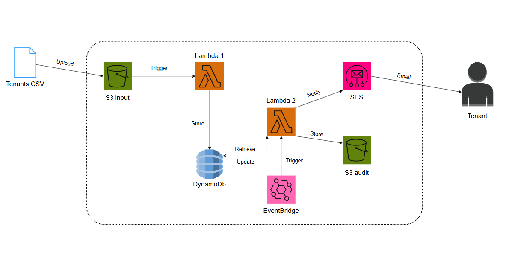
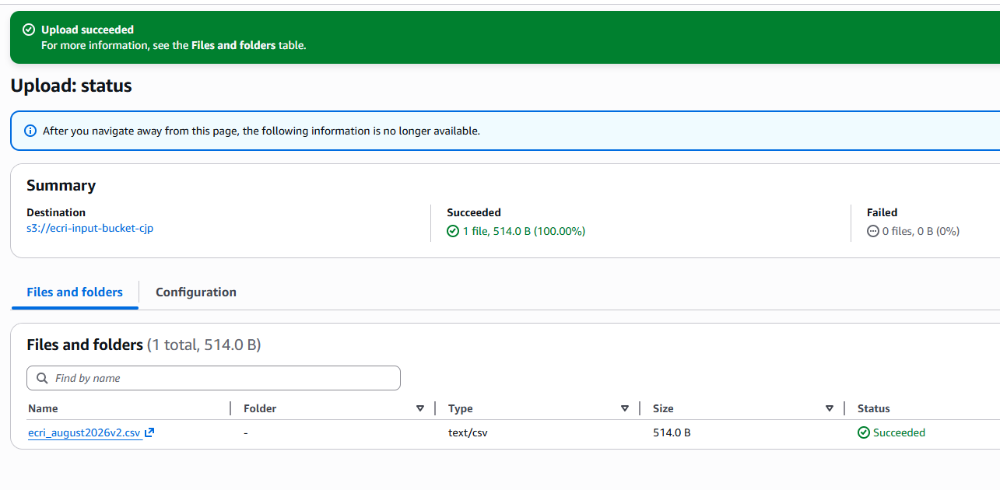
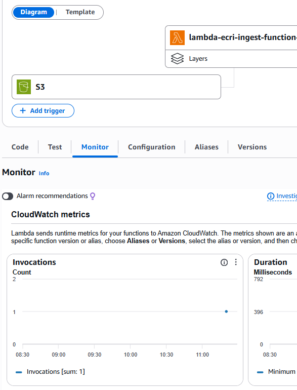
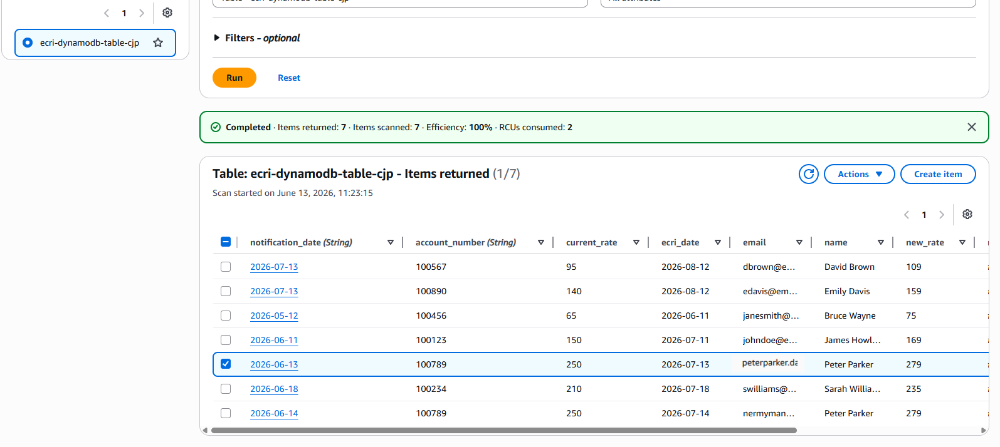
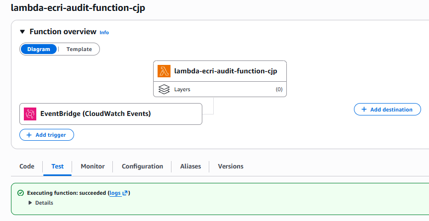
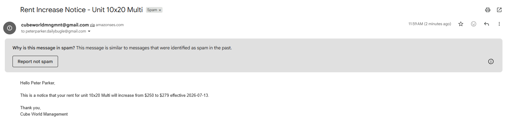
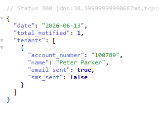
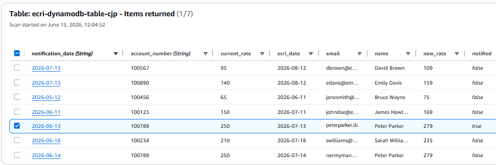
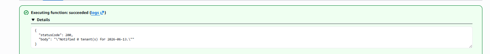

# AWS ECRI Tenant Notification Pipeline

An event-driven, serverless ECRI (Existing Customer Rate Increase) Notification Pipeline designed in Terraform that notifies tenants a month in advance via email on the same day their physical mail notice goes out. A CSV of tenants that are due for a rate increase is uploaded to S3, it triggers the first Lambda Function to parse the list into DynamoDb where it is stored. From there, an EventBridge schedule triggers the second Lambda Function that checks who is due for a notice that day, emails them through SES, logs it into an S3 audit bucket, and marks them as notified so they don’t get the same alert twice. I built this because at my current job, tenants are only notified via physical mail about their rate increase and most of the time they call our facilities expressing they were never notified (even if they were). This usually happens on the day of their rent increase or after the money has been taken from their bank.

**ECRI Pipeline Diagram**

## Services Used:

**S3** -  Stores the tenant CSV in the input bucket and serves as an audit trail in the output bucket, holding a JSON record confirming which tenants were notified and when.

**Lambda** -  Two functions for operation. Lambda 1 parses the uploaded CSV and writes tenant records to DynamoDB. Lambda 2, triggered daily by EventBridge, queries DynamoDB for tenants due for notification, sends the email via SES, writes the audit log to S3, and marks the tenant as notified.

**DynamoDB** - Stores tenant records loaded by Lambda 1, using notification_date as the partition key so Lambda 2 can efficiently query "who's due today" without scanning the entire table. Chosen for its serverless, pay-per-request model, so no capacity planning was needed for a workload this small.

**EventBridge** - Triggers Lambda 2 on a daily schedule, so notifications go out automatically.

**SES** - Sends the rate increase notification email to the tenant.

**IAM** - Two separate least-privilege roles, one per Lambda function, each scoped via inline policy to only the specific S3 buckets, DynamoDB table, and SES actions that function needs.

**Terraform** - The entire infrastructure is defined as code, making the pipeline reproducible and version controlled rather than manually clicked together in AWS’s console.

## Security Design:

Two separate IAM roles were created, Lambda 1 and Lambda 2, following the principle of least privilege. Lambda 1's role is granted the permission to get the CSV from the Input bucket and store it on the DynamoDB table, allowing it to read the uploaded CSV and write tenant records. Lambda 2's role is to query and update the DynamoDb table, notify SES to send tenants an email, and store that they have been notified in the audit bucket once the table has been updated.

Both permissions are inline policies instead of managed policies, ensuring these permissions exist only on their specific role and can't be used elsewhere by accident.

SSE-KMS is used since the input bucket holds tenant CSVs and the audit bucket holds records of tenant names and emails. KMS provides CloudTrail logged access to that data, rather than just encryption with no audit trail. Public Access is blocked on both buckets to insure there are no external exposures.

## Scope Decisions:

The original design included three types of notifications; email via SES, and SMS and app push notifications via SNS. SNS was scoped out of this implementation, though the architecture and IAM permissions support them.

**SMS via SNS** was implemented in code but disabled before deployment. AWS requires a toll-free or 10DLC number before SNS can send SMS, due to US carrier spam regulations. These are around $2 a month and a multi-day carrier approval process. This is a real production constraint, not a code limitation but I left the `sns:Publish` permission remains in the IAM policy, and the code is commented with the reasoning, so in the near future IF needed, it could be ready for use.

**App push notifications** were scoped out for two reasons. Technically, push notifications require SNS Mobile Push integration with a registered platform application and per-device endpoint registration during app onboarding which wasn’t possible at the time. When looking at real tenant accounts, the majority of the tenants at my facility have the app’s push notifications turned off, making push an unreliable primary channel even if implemented. Email was determined to be the most practical channel because they require no recipient action (unlike SNS topic subscriptions, which need confirmation) and it reaches tenants regardless of app settings (unless sender email is blocked which is rare).

## Troubleshooting & Lessons Learned:

A couple of issues were revealed in deployment which needed debugging:

**CSV parsing failure.** Lambda 1 was triggered correctly on upload, but no records appeared in DynamoDB. Having hit a similar issue in a previous project with LibreOffice PDF exports, the CSV export tool was the first suspect. The file had been created in LibreOffice; recreating it in Google Sheets and re-uploading resolved the issue immediately. 
- Lesson: file format quirks from certain export tools can silently break AWS parsing, even for "simple" formats like CSV.

**Leftover variable reference.** Lambda 2 failed on invocation because of SNS_TOPIC. This was a leftover reference from an earlier design that included an SNS topic, which was later removed (see Scope Decisions). The line was commented out with an explanation rather than deleted, documenting the design history and leaving it ready to re-enable if SMS is added later.

**IAM action typo.** After fixing the SNS issue, Lambda 2 failed again but this time with an `AccessDeniedException` on `dynamodb:UpdateItem` (to mark the tenant notified upon delivery). The inline policy had the action misspelled as `dyynamodb:UpdateItem`. Correcting the typo and redeploying resolved it. 
- Lesson: IAM policy actions are exact strings so a single-character typo will cause issues, only an access-denied at runtime.

**SES sandbox restrictions.** Once the issues above were fixed, Lambda 2 still failed with `MessageRejected: Email address is not verified`. The sender was verified but the tenant recipient email wasn't. In SES, every recipient must be individually verified. Verifying the tenant's email resolved it, and the notification email was delivered successfully.

**Idempotency verification.** After a successful run marked the tenant as `notified: true`, re-invoking Lambda 2 returned "Notified 0 tenant(s)" which confirmed the duplicate-prevention check works as designed.

## Setup & Configurations:

**providers.tf** - AWS provider configuration and required Terraform version

**variables.tf / terraform.tfvars** - variable declarations and values (bucket names, region, table name, SES sender email)

**s3.tf** - input and audit S3 buckets, with SSE-KMS encryption and public access blocked

**dynamodb.tf** - DynamoDB table with notification_date as partition key and account_number as sort key

**iam.tf** - two least-privilege IAM roles (one per Lambda), each with an inline policy and AWSLambdaBasicExecutionRole attached

**lambda.tf** - both Lambda functions, code packaged via archive_file, plus the S3 trigger for Lambda 1

**eventbridge.tf** - daily scheduled rule that triggers Lambda 2

**ses.tf** - verified sender email identity

## Results:

- Tenants CSV uplaoded to the S3 Input bucket.

- Lambda 1 function retrieving the csv from S3 input bucket for DynamnoDB parsing

- DynamoDb parsed Tenant data

- Eventbridge triggering Lambda 2 to search for which tenants are due for an ECRI notification, send an email, and udpate dynamodb notification_date row

- Email regarding ECRI has been sent to tenant

- S3 Audit bucket showing that tenant has been been true for emailing

- DynamoDB notication_date marked as true for tenant Peter Parker

- Idempotency confirmation that "Notified 0 tenant(s)" once Lambda 2 was ran for a second time.

## What I learned: 

This project reinforced a few things:

- File export format can break a pipeline even when the file "looks" fine (same lesson as my last project, different file type). 

- IAM action names are exact strings and a one-character typo fails silently with no warning until something tries to use the permission.

- Lambda runs on UTC regardless of local time, which matters for anything date-based (that conversion in `schedule_expression` was a pain). 

- And designing for features I ultimately couldn't ship (SMS, push) wasn't wasted effort but it forced me to research real constraints like carrier registration requirements and think about which channels actually reach people, based on real account data instead of assumptions.
